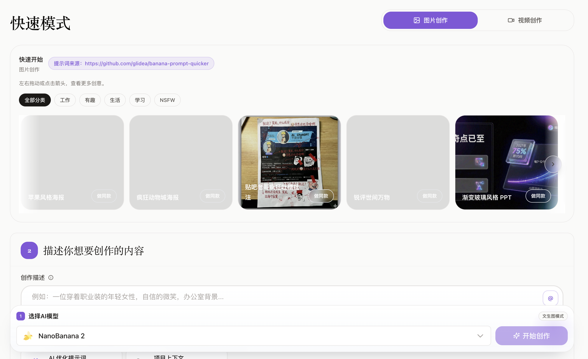
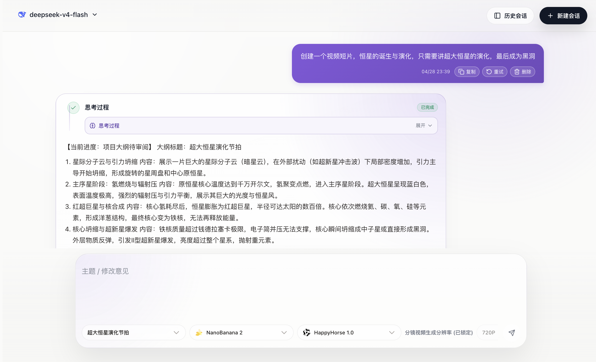
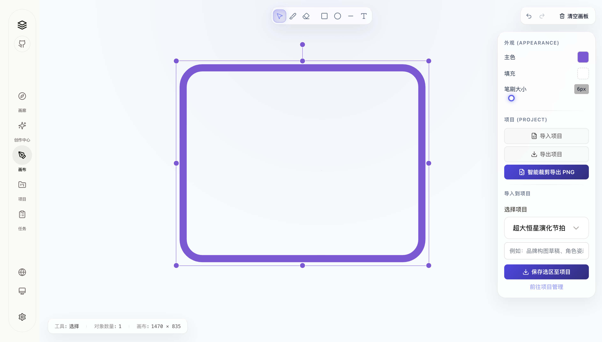
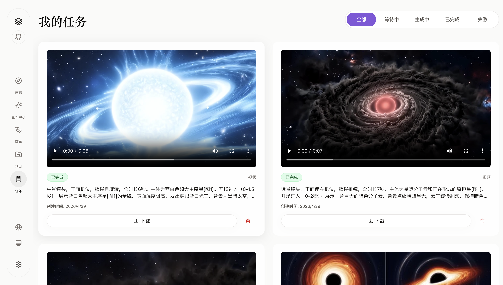

<p align="center">
  
</p>

<h1 align="center">FlowMuse</h1>

<p align="center">
  本地优先的 AI 图片与视频创作工作台。把提示词、生成任务、项目素材、聊天工作流和桌面应用整合到一个地方。
</p>

<p align="center">
  <a href="https://github.com/hjxwz123/FlowMuseGallery">
    
  </a>
  
  
  
  
  
</p>

<p align="center">
  <a href="#-快速开始">快速开始</a>
  ·
  <a href="#-界面预览">界面预览</a>
  ·
  <a href="#-功能亮点">功能亮点</a>
  ·
  <a href="#-核心模块">核心模块</a>
  ·
  <a href="#-桌面应用">桌面应用</a>
  ·
  <a href="#-目录结构">目录结构</a>
</p>

---

## 🖼️ 界面预览

FlowMuse 以创作工作台为核心，把首页入口、快速生成、对话式工作流、在线画板和任务追踪串成一条本地优先的创作链路。


## ✨ 功能亮点

| 能力 | 说明 |
| --- | --- |
| 本地优先 | SQLite 保存数据，本地 `uploads/` 保存生成结果和上传资源，桌面端写入系统用户数据目录。 |
| 双端运行 | 同一套代码支持浏览器服务模式，也支持 Electron 打包为 macOS / Windows 桌面应用。 |
| 统一创作入口 | 图片创作、视频创作、参考素材、项目上下文和提示词优化集中在一个工作台。 |
| 对话式工作流 | 支持聊天模型、文件上传、项目导入、图片 Agent、视频分镜规划和自动创作流程。 |
| 项目资产沉淀 | 项目可保存描述、素材、文档、灵感、项目级提示词和历史作品。 |
| 任务可追踪 | 图片 / 视频任务统一管理，展示状态、结果、失败原因，并支持重试、删除和下载。 |
| 内置提示词库 | 图片和视频提示词从本地 JSON 加载，支持搜索、筛选和一键套用。 |
| 可选 COS | 默认本地保存；需要公网素材 URL 时可配置腾讯云 COS。 |

## 🧭 应用导航

| 页面 | 用途 |
| --- | --- |
| 首页 | 展示 FlowMuse 入口和本地作品 Hero 轮播。 |
| 画廊 | 以瀑布流查看本地完成的图片和视频作品。 |
| 快速模式 | 直接发起图片或视频生成任务。 |
| 工作流模式 | 通过对话推进图片 Agent、视频分镜和自动创作。 |
| 在线画板 | 画草图、标注、排构图，并导出 PNG 或保存到项目。 |
| 项目管理 | 管理项目描述、素材、文档、灵感和项目级提示词。 |
| 任务中心 | 查看任务状态、失败原因、结果和后续操作。 |
| 系统设置 | 配置对话模型、媒体渠道和可选 COS 存储。 |

## 🧩 核心模块

### 快速模式



- 图片创作：文生图、图生图、参考图输入、多模型选择、比例和尺寸参数。
- 视频创作：文生视频、图生视频、参考图片 / 视频 / 音频输入、模型参数适配。
- 项目上下文：从项目中选择可复用素材，让同一主题的创作保持一致。
- 提示词优化：把简短描述扩展为更完整、更具画面感的提示词版本。
- 网络提示词：从本地 JSON 提示词库中搜索、筛选并套用提示词。

### 创作工作流


- 多轮聊天和会话历史。
- 聊天模型选择与排序。
- 项目上下文导入。
- 图片上传作为视觉参考。
- 文档上传作为上下文材料。
- 在聊天中直接创建图片任务。
- 在聊天中规划视频分镜并提交视频任务。
- 自动视频流程会根据镜头规划、上一镜视频、尾帧图片和模型能力组织任务参数。



### 项目管理

- 新建、编辑、删除项目。
- 上传图片、视频和文档素材。
- 导入历史生成作品。
- 搜索和筛选项目素材。
- 使用 AI 生成项目描述。
- 管理项目灵感和视频分镜提示词。
- 维护项目级图片 / 视频提示词，让同一项目的风格更稳定。

### 在线画板



- 自由画笔、橡皮擦、矩形、圆形、直线、文本和图片导入。
- 支持选中、拖动、缩放、旋转、撤销和重做。
- 支持导出 PNG。
- 支持导入 / 导出画板 JSON。
- 支持把画板结果保存为项目图片素材。

### 任务中心



- 图片和视频任务统一列表。
- 按全部、等待中、生成中、已完成、失败筛选。
- 失败任务展示明确失败原因。
- 支持取消、重试、删除和下载。
- Midjourney 任务支持放大、变体、重新生成、局部重绘等后续操作。

## 🤖 模型与渠道

FlowMuse 固定内置媒体渠道，用户只需要在设置里填写对应渠道的 `Base URL` 和 `API Key`。

| 渠道 | 用途 |
| --- | --- |
| NanoBanana | 图片生成与编辑 |
| Midjourney | 图片生成与后续操作 |
| GPT Image | 图片生成 |
| 火山豆包 | 图片 / 视频生成 |
| 通义千问 | 图片生成 |
| 通义万相 | 视频生成 |

内置媒体模型：

| 类型 | 模型 |
| --- | --- |
| 图片 | NanoBanana、Nano Banana Pro、NanoBanana 2、GPT Image 2、Midjourney、Seedream 4.5、Seedream 5.0 Lite、Qwen Image 2.0 Pro、万相 2.7 Image |
| 视频 | HappyHorse 1.0、Seedance 2.0、Seedance 2.0 Fast、万相2.7 Video、万相2.7 文生视频、万相2.7-图生视频 |

## 💬 聊天文件上传

| 限制 | 值 |
| --- | --- |
| 单条消息最多文件数 | `5` |
| 单文件大小上限 | `20MB` |
| 支持扩展名 | `txt`、`md`、`csv`、`json`、`html`、`pdf`、`docx`、`pptx`、`xlsx` |

上传后的文档会被解析为文本，并作为聊天上下文参与回答。

## 🏗️ 技术栈

| 层 | 技术 |
| --- | --- |
| 前端 | React 19、Vite 6、TypeScript、Tailwind CSS |
| 后端 | NestJS 10、TypeScript |
| 数据库 | SQLite、Prisma |
| 桌面端 | Electron、electron-builder |
| 文件处理 | Sharp、Multer、PDF / DOCX / PPTX / XLSX 解析 |
| 任务执行 | 后端进程内本地任务执行器 |

## 🚀 快速开始

### 1. 安装依赖

```bash
npm install
cd frontend && npm install
cd ..
```

### 2. 配置环境变量

```bash
cp .env.example .env
```

常用配置：

```env
DATABASE_URL="file:./data/flowmuse.sqlite"
PORT=3000
FRONTEND_PORT=3001
BACKEND_URL="http://127.0.0.1:3000"
APP_PUBLIC_URL="http://localhost:3000"
FRONTEND_URL="http://localhost:5173"
APP_ENCRYPTION_KEY="change-me-32-bytes-minimum-length"
```

> `APP_ENCRYPTION_KEY` 用于加密保存 API Key，建议首次运行前替换成自己的长随机字符串。

### 3. 初始化数据库

```bash
npm run prisma:generate
npm run prisma:init
```

初始化会创建 SQLite 表结构，并写入固定渠道、内置模型和本地用户数据。

### 4. 启动浏览器模式

```bash
npm run dev:all
```

默认地址：

| 服务 | 地址 |
| --- | --- |
| 前端 | `http://localhost:5173` |
| 后端 API | `http://localhost:3000/api` |
| 本地资源 | `http://localhost:3000/uploads/...` |

## 📦 生产运行

构建：

```bash
npm run build:all
```

启动：

```bash
npm run start:all
```

默认生产前端地址：

```text
http://localhost:3001
```

## 🖥️ 桌面应用

开发运行：

```bash
npm run desktop:dev
```

生成未压缩应用目录：

```bash
npm run desktop:pack
```

生成安装包：

```bash
npm run desktop:dist
```

输出目录：

```text
release/
```

当前桌面打包目标：

| 系统 | 产物 |
| --- | --- |
| macOS | `dmg` |
| Windows | `nsis` 安装包 |

## 🐳 Docker

```bash
docker compose up -d --build
```

默认端口：

| 服务 | 端口 |
| --- | --- |
| 后端 | `3000` |
| 前端 | `3001` |

持久化目录：

| 目录 | 内容 |
| --- | --- |
| `./data/sqlite` | SQLite 数据库 |
| `./data/uploads` | 生成结果和上传资源 |

覆盖端口：

```bash
BACKEND_PORT=6000 FRONTEND_PORT=6001 docker compose up -d --build
```

## 💾 数据目录

### 浏览器服务模式

| 内容 | 默认位置 |
| --- | --- |
| SQLite | `prisma/data/flowmuse.sqlite` |
| 本地资源 | `uploads/` |

`DATABASE_URL` 的相对路径以 `prisma/schema.prisma` 所在目录为基准。

### 桌面应用模式

| 系统 | 用户数据目录 |
| --- | --- |
| macOS | `~/Library/Application Support/FlowMuse/` |
| Windows | `%APPDATA%/FlowMuse/` |
| Linux | `~/.config/FlowMuse/` |

桌面数据目录内容：

| 路径 | 内容 |
| --- | --- |
| `data/flowmuse.sqlite` | SQLite 数据库 |
| `uploads/` | 本地生成结果和上传资源 |
| `security/encryption-key` | API Key 加密密钥 |

## 📁 目录结构

```text
electron/                       Electron 桌面端入口
frontend/                       React + Vite 前端
frontend/public/json/           本地提示词数据
frontend/public/icons/          应用图标
frontend/public/model-icons/    模型图标
image/                          README 项目截图
prisma/                         Prisma schema、SQLite 初始化 SQL、默认模型配置
scripts/                        初始化脚本
src/                            NestJS 后端
src/adapters/                   模型适配器
src/chat/                       对话、文件解析、自动工作流
src/images/                     图片任务
src/videos/                     视频任务
src/projects/                   项目与素材管理
src/storage/                    本地与 COS 存储
src/local-runner/               本地任务执行器
uploads/                        浏览器服务模式下的本地资源目录
release/                        桌面打包产物
```

## 🧠 提示词数据

| 类型 | 路径 |
| --- | --- |
| 图片提示词 | `frontend/public/json/prompts.json` |
| 视频提示词 | `frontend/public/json/prompts-videos.json` |

图片提示词来源：

```text
https://github.com/glidea/banana-prompt-quicker
```

运行时直接读取本地 JSON 文件，不需要远程拉取提示词数据。

## 🧰 常用命令

```bash
npm run prisma:generate
npm run prisma:init
npm run dev:all
npm run build:all
npm run start:all
npm run desktop:dev
npm run desktop:pack
npm run desktop:dist
cd frontend && npm run type-check
```

## 🔗 仓库

```text
https://github.com/hjxwz123/FlowMuseGallery
```

## 📄 License

FlowMuse is licensed under the MIT License. See [LICENSE](LICENSE) for details.
